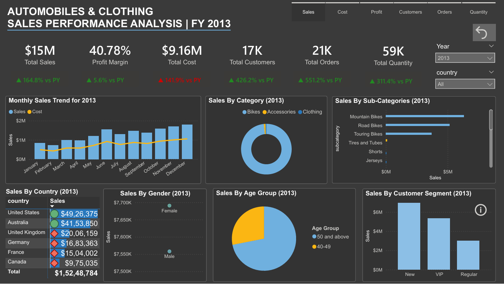

# Automobile & Clothing Sales Performance Analytics
## 🏗️ End-to-End Medallion Architecture | SQL Server & Power BI

[](https://www.microsoft.com/en-us/sql-server)
[](https://powerbi.microsoft.com/)

### 🚀 Business Overview
This repository demonstrates a full-cycle Data Engineering and Business Intelligence solution. It transforms raw, siloed sales data into a high-performance interactive dashboard. By implementing a **Medallion Architecture**, the solution ensures data integrity from ingestion to final visualization, providing stakeholders with a "Single Source of Truth" for global sales performance.

### 📊 Executive Dashboard Insights

*Figure 1: Final Interactive Dashboard showing the 2013 Performance Analysis.*

**Key Features Visible in the Report:**
* **Metric Selector (Tabs):** A custom-engineered navigation bar allowing users to switch the entire report view between **Sales, Cost, Profit, Customers, Orders, and Quantity**.
* **KPI Scorecard:** Real-time tracking of Total Sales ($15M), Profit Margin (40.78%), and Total Customers (17K) with automated Year-over-Year (YoY) growth indicators.
* **Trend Analysis:** A Monthly Sales Trend for 2013 that combines bar and line charts to visualize revenue vs. cost across the fiscal year.
* **Demographic Segmentation:** Detailed breakdowns of sales by Gender, Age Group (focused on 50+ and 40-49), and Customer Segment (New, VIP, Regular).

---

### 🏗️ Data Architecture: The Medallion Approach
The data is processed through three distinct layers within SQL Server to ensure quality and performance:

1. **Bronze (Raw):** Initial ingestion of source data (Sales, Products, Customers, Geography) with minimal changes.
2. **Silver (Cleansed):** Data deduplication, handling null values, and enforcing schema consistency.
3. **Gold (Curated):** Final dimension and fact tables (Star Schema) optimized for Power BI consumption, including aggregated sales metrics.

---

### 🚀 Key Analytics & DAX Engineering
The Power BI dashboard was engineered for high interactivity and "Latest Year" focus:

* **Dynamic Metric Switching:** Utilizes **Field Parameters** allowing users to toggle the entire report between Sales, Profit, Orders, and Customers with a single click.
* **Time-Intelligence DAX:** Custom measures implemented to automatically lock visuals to the **Latest Complete Year (FY 2013)** while maintaining YoY growth context.
* **Dynamic Titling:** Context-aware headers that update based on the selected metric (e.g., "Monthly Sales Trend for 2013").
* **Responsive X-Axis:** Engineered to "snap" to monthly trends for the selected year, removing historical noise.

---
### 📂 Repository Structure

* **📂 Reports/**: Contains the Power BI production files and dashboard documentation.
    * `automobiles_sales_report.pbix`: The primary Power BI semantic model and dashboard.
    * `automobiles_clothing_sales_report.png`: High-resolution dashboard screenshot for README documentation.
* **📂 Sql_data_Warehouse/**: The core Data Engineering directory housing the Medallion pipeline assets.
    * **📂 datasets/**: Contains source data or sample files used for ingestion.
    * **📂 docs/**: Documentation specifically for the SQL Data Warehouse architecture.
    * **📂 scripts/**: T-SQL scripts for Bronze, Silver, and Gold layer transformations.
    * **📂 tests/**: SQL unit tests and data quality checks.
    * `README.MD`: Specific documentation for the SQL warehouse project.
* **📂 data_analysis/**: Contains supplementary analytical documentation and data curated for reporting.
    * **📂 docs/**: Business logic and analysis documentation.
    * **📂 gold_layer-csv-files/**: Exported curated data used for final analysis.
    * **📂 scripts/**: Python or SQL scripts used specifically for ad-hoc data analysis.
* `LICENSE`: Legal permissions and usage terms for the repository.
* `README.md`: The main project documentation and executive summary.
---

### 💡 DAX Highlights: Dynamic Metric Parameter
The core of the dashboard's flexibility is the `Select Metric` field parameter:

```dax
Select Metric = {
    ("Sales", NAMEOF([Sales (Latest Year)]), 0),
    ("Cost", NAMEOF([Total Cost]), 1),
    ("Profit", NAMEOF([Profit (Latest Year)]), 2),
    ("Customers", NAMEOF([Customers (Latest Year)]), 3),
    ("Orders", NAMEOF([Orders (Latest Year)]), 4),
    ("Quantity", NAMEOF([Total Quantity]), 5)
}
```
### ⚙️ Implementation Guide
1. **Environment Setup**: Ensure Microsoft SQL Server is running.
2. **Database Build**: Execute the scripts in the `SQL_Scripts` folder in sequence (Bronze → Silver → Gold).
3. **Power BI Configuration**: Open `Reports/automobiles_report.pbix`.
4. **Data Source Mapping**: Update the **Data Source Settings** to point to your specific SQL Server instance and database.
5. **Data Refresh**: Click **'Refresh'** in Power BI to propagate the Medallion data through the model into the visuals.

---

### 🛠 Tech Stack
* **Database Engine:** Microsoft SQL Server
* **Language:** Advanced T-SQL (CTEs, Window Functions, DDL/DML)
* **Architecture Pattern:** Medallion (Data Lakehouse style)
* **Modeling:** Dimensional Modeling (Star Schema)
* **Data Analytics tool:** Power BI

---

### 🤝 Credits
Special thanks to **Baraa** for the detailed walkthrough and for sharing these data engineering best practices.
* **YouTube Channel:** [Data with Baraa](https://www.youtube.com/@DataWithBaraa)
* **Video Link:** [https://youtu.be/SSKVgrwhzus?si=S_Z996sWs94jZSZL](https://youtu.be/SSKVgrwhzus?si=S_Z996sWs94jZSZL)
  
---
