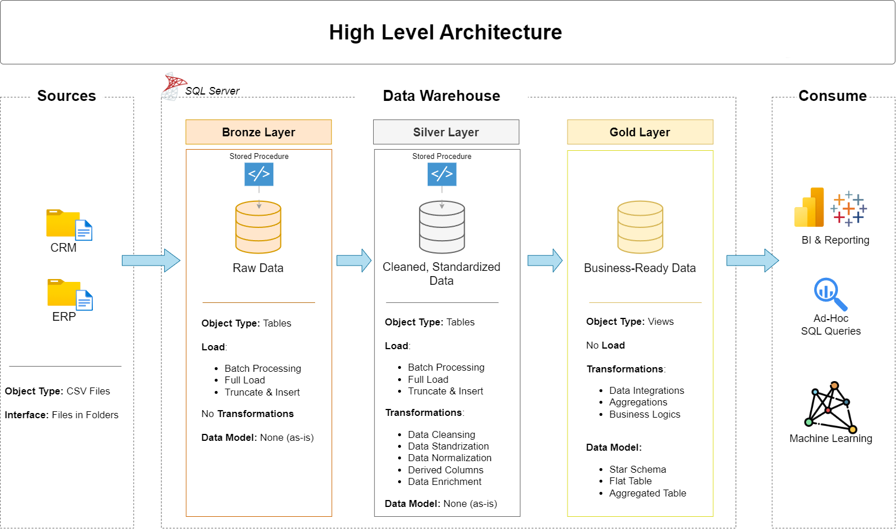

# Sql Data Warehouse 

Welcome to the **SQL Data Warehouse Project** repository! 🚀  .

---
## 🏗️ Data Architecture

The data architecture for this project follows Medallion Architecture **Bronze**, **Silver**, and **Gold** layers:


1. **Bronze Layer**: Stores raw data as-is from the source systems. Data is ingested from CSV Files into SQL Server Database.
2. **Silver Layer**: This layer includes data cleansing, standardization, and normalization processes to prepare data for analysis.
3. **Gold Layer**: Houses business-ready data modeled into a star schema required for reporting and analytics.

---

## 📌 Key Objectives
* Architecture: Implementation of Bronze (Raw), Silver (Cleaned), and Gold (Business) layers.
* Automation: Using stored procedures to automate the loading and transformation processes.
* Data Quality: Rigorous validation and testing at each stage of the pipeline.

---

## 📂 Project Structure


```
SQL_data_warehouse_project/
├── source_crm/                 # Raw CRM Data (CSV files)
│   ├── cust_info.csv
│   ├── prd_info.csv
│   └── sales_details.csv
├── source_erp/                 # Raw ERP Data (CSV files)
│   ├── CUST_AZ12.csv
│   ├── LOC_A101.csv
│   └── PX_CAT_G1V2.csv
├── scripts/                    # SQL Implementation Scripts
│   ├── bronze/
│   │   ├── ddl_bronze.sql
│   │   └── proc_load_bronze.sql
│   ├── silver/
│   │   ├── ddl_silver.sql
│   │   └── proc_load_silver.sql
│   ├── gold/
│   │   └── ddl_gold.sql
│   └── init_database.sql       # Database initialization script
├── tests/                      # Quality Assurance & Validation
│   ├── quality_checks_silver.sql
│   └── quality_checks_gold.sql
├── LICENSE
└── README.md
```


## 🚀 Setup and Installation

1. **Initialize Database:** Execute the script to create the database and setup the bronze, silver, and gold schemas.
   * **Command:** Run `init_database.sql` in your SQL environment.

2. **Ingestion (Bronze Layer):** Create the staging tables and load the raw CSV files using the stored procedure.
   * **Command:** Run `ddl_bronze.sql` then `EXEC bronze.proc_load_bronze;`

3. **Transformation (Silver Layer):** Clean and transform the raw data into a relational format.
   * **Command:** Run `ddl_silver.sql` then `EXEC silver.proc_load_silver;`

4. **Presentation (Gold Layer):** Create the final views and tables optimized for reporting.
   * **Command:** Run `ddl_gold.sql`

---

## 🧪 Validation
Data quality is verified using scripts in the `/tests` folder to ensure no duplicates, correct data types, and referential integrity:
* **quality_checks_silver.sql**: Validates data cleaning success and format standardization.
* **quality_checks_gold.sql**: Validates business logic and final analytical aggregations.

---

## 🤝 Credits
Special thanks to **Baraa** for the detailed walkthrough and for sharing these data engineering best practices.
* **YouTube Channel:** [Data with Baraa](https://www.youtube.com/@DataWithBaraa)
* **Video Link:** [https://youtu.be/SSKVgrwhzus?si=S_Z996sWs94jZSZL](https://youtu.be/SSKVgrwhzus?si=S_Z996sWs94jZSZL)

---
*Created as part of a Data Engineering Portfolio.*
